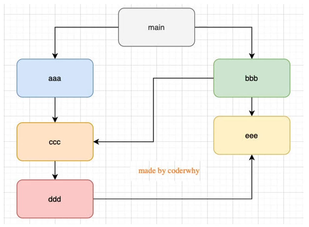

# Node学习笔记 学会了就是自己的
## 1.模块的加载过程
  * 模块在第一次被引入时，模块中的js代码会被运行一次
  * 模块被多次引入时，会缓存，最终只会运行一次
     * 每个模块对象module都有一个属性：loaded，用来标识模块是否被加载过

## 2.图结构遍历之深度优先和广度优先

### 2.1 深度优先遍历
   * 从根节点开始，一直向下遍历，直到没有子节点，再回到父节点，再向下遍历
### 2.2 广度优先遍历
   * 从根节点开始，一层一层向下遍历

## 3.Node常用内置模块
### 3.1 path的常用方法
   * 先导入path模块
   * const path = require('path')
     * path.basename(path[,ext])  返回path的最后一部分
     * path.dirname(path)  返回path的目录名
     * path.extname(path)  返回path的扩展名 后缀名
     * path.join([...paths])  将多个路径拼接成一个路径
     * path.parse(path)  返回path的对象表示
     * path.relative(from,to)  返回从from到to的相对路径
     * path.resolve([...paths])  将多个路径解析为一个绝对路径

### 3.2 fs的常用方法
   * 先导入fs模块
   * const fs = require('fs')
   * 这些api大多数提供三种操作方式：同步、异步、promise
     * fs.stat(path[,options],callback)  检测文件或目录的状态
     * fs.readFile(path[,options],callback)  异步读取文件
     * fs.readFileSync(path[,options])  同步读取文件
     * fs.writeFile(file,data[,options],callback)  异步写入文件
     * fs.writeFileSync(file,data[,options])  同步写入文件
     * fs.appendFile(file,data[,options],callback)  异步追加文件
     * fs.appendFileSync(file,data[,options])  同步追加文件
     * fs.unlink(path,callback)  异步删除文件
     * fs.unlinkSync(path)  同步删除文件
     * fs.rename(oldPath,newPath,callback)  异步重命名文件
     * fs.renameSync(oldPath,newPath)  同步重命名文件
     * fs.mkdir(path[,options],callback)  异步创建目录
     * fs.mkdirSync(path[,options])  同步创建目录
     * promise的使用
       * fs.promises.stat(path).then(()=>{})  检测文件或目录的状态
      
### 3.3 文件的读写
```js
const fs = require('fs')

// 读取文件
fs.readFile('./test.txt', {encoding: 'utf-8'}, err => {
   console.log(err)
})

// 写入文件
fs.writeFile('./test.txt', 'hello world', {flag: 'a'}, (err) => {
  if (err) {
    console.log(err)
  } else {
    console.log('写入成功')
  }
})
```
* flag的值
  * 'a'  追加
  * 'a+' 追加和读取
  * 'w'  写入
  * 'w+' 写入和读取
  * 'r'  读取
  * 'r+' 读取和写入

### 3.4 文件夹的操作
```js
const fs = require('fs')
const path = require('path')

const fileName = './Eddie';
// 创建文件夹
if(!fs.existsSync(fileName)) {
  fs.mkdir(fileName, err => {
    if (err) {
      console.log(err)
    } else {
      console.log('创建成功')
    }
  })
} else {
  console.log('文件夹已存在')
}

// 删除文件夹
fs.rmdir(fileName, err => {
  if (err) {
    console.log(err)
  } else {
    console.log('删除成功')
  }
})

// 读取文件夹
fs.readdir(fileName, (err, files) => {
  if (err) {
    console.log(err)
  } else {
    console.log(files)
  }
})

// 递归读取文件夹下面的所有文件
function getFiles(dirname) {
  fs.readdir(dirname, { withFileTypes: true }, (err, files) => { // withFileTypes: true 读取文件夹下面的文件类型
    for (let file of files) {
      // fs.stat(file) 可以, 但是有点麻烦
      if (file.isDirectory()) { // 判断是否是文件夹
        const filepath = path.resolve(dirname, file.name); // 拼接文件路径
        getFiles(filepath);
      } else {
        console.log(file.name);
      }
    }
  });
}

getFiles(dirname);

// 重命名文件夹
fs.rename(fileName, './Eddie2', err => {
  if (err) {
    console.log(err)
  } else {
    console.log('重命名成功')
  }
})
```
## 4. events模块的使用
* events模块是nodejs的核心模块，用于处理事件
```js
const EventEmitter = require('events')

// 创建一个发射器
const emitter = new EventEmitter()

// 监听事件
emitter.on('click', (msg) => {
  console.log('监听事件1', msg)
})

const fn = (msg) => {
  console.log('监听事件2', msg)
}
emitter.on('click', fn)

emitter.once('click', (msg) => { // once只监听一次
    console.log("监听3到click事件", msg);
})

// 触发事件
setTimeout(() => {
  emitter.emit('click', 'hello world')
  emitter.off('click', fn) // 取消监听事件
  emitter.emit('click', fn) 
}, 1000)
```
## 5. 浏览器事件循环
* 宏任务队列：ajax、setTimeout、setInterval、DOM监听、UI Rendering等
* 微任务队列：Promise的then回调、MUtation ObserverAPI(很少用)、queueMicrotask()等
* 执行顺序
  * 先执行mainScript的代码
  * 然后执行完微任务队列的所有代码再去执行宏任务队列的代码
### 5.1 宏任务微任务面试题一
```js
setTimeout(function () {
    console.log("set1");
    new Promise(function (resolve) {
        resolve();
    }).then(function () {
        new Promise(function (resolve) {
            resolve();
        }).then(function () {
            console.log("then4");
        });
        console.log("then2");
    });
});

new Promise(function (resolve) {
    console.log("pr1");
    resolve();
}).then(function () {
    console.log("then1");
});

setTimeout(function () {
    console.log("set2");
});

console.log(2);

queueMicrotask(() => {
    console.log("queueMicrotask1")
});

new Promise(function (resolve) {
    resolve();
}).then(function () {
    console.log("then3");
});

// pr1
// 2
// then1
// queuemicrotask1
// then3
// set1
// then2
// then4
// set2

```
### 5.2 宏任务微任务面试题二
```js
async function async1 () {
  console.log('async1 start')
  await async2(); // 等价于new Promise里面的代码 直接打印
  console.log('async1 end') // 等价于then里面的代码 是微任务
}
 
async function async2 () {
  console.log('async2')
}

console.log('script start')

setTimeout(function () {
  console.log('setTimeout')
}, 0)
 
async1();
 
new Promise (function (resolve) {
  console.log('promise1')
  resolve();
}).then (function () {
  console.log('promise2')
})

console.log('script end')


// script start
// async1 start
// async2
// promise1
// script end
// aysnc1 end
// promise2
// setToueout
```
## 6. Node的事件循环
* Node的事件循环是基于libuv库的
* Node的事件循环分为6个阶段
  * timers: 执行setTimeout和setInterval的回调
  * pending callbacks: 执行系统级别的回调，如TCP错误
  * idle, prepare: 仅系统内部使用
  * poll: 获取新的I/O事件，适当的条件下node将阻塞在这里
  * check: 执行setImmediate的回调
  * close callbacks: 执行socket的close事件的回调
  * 事件循环的顺序是 mainScript-> nextTicks -> other microtask(微任务) -> timers(定时器) -> Poll(轮询：检索新的I/O事件)(面试题不会出) -> check(setImmediate) ->close callbacks(关闭回调)

### 6.1 Node的事件循环面试题一
```js
async function async1() {
  console.log('async1 start')
  await async2()
  console.log('async1 end')
}

async function async2() {
  console.log('async2')
}

console.log('script start')

setTimeout(function () {
  console.log('setTimeout0')
}, 0)

setTimeout(function () {
  console.log('setTimeout2')
}, 300)

setImmediate(() => console.log('setImmediate'));

process.nextTick(() => console.log('nextTick1'));

async1();

process.nextTick(() => console.log('nextTick2'));

new Promise(function (resolve) {
  console.log('promise1')
  resolve();
  console.log('promise2')
}).then(function () {
  console.log('promise3')
})

console.log('script end')


// script start
// async1 start
// async2
// promise1
// promise2
// script end
// nextTick1
// nextTick2
// async1 end
//  promise3
// setTimeout0
// setImmediate
// setTimeout2
```
